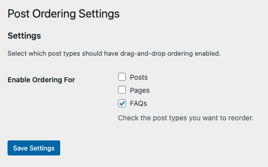
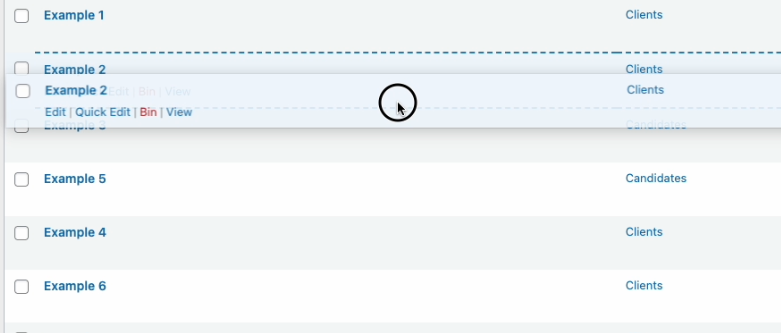

Drag-and-drop reordering for WordPress posts, pages, and custom post types with persistent storage.


---

## Features

- **Native WordPress Integration** - Works directly on edit.php pages
- **Auto-Save** - Changes saved automatically on drop
- **Universal Compatibility** - Works with all queries (main query & custom WP_Query)
- **Non-Intrusive** - Respects explicit `orderby` parameters
- **Security-First** - Nonce verification and capability checks
- **Zero Configuration** - Works out of the box with posts and pages
- **Modern Architecture** - PHP 8.0+, PSR-4 autoloading, strict types
- **Minimal VUE** - Settings Configuration

---

## Requirements

- **PHP:** 8.0 or higher
- **WordPress:** 6.0 or higher
- **User Role:** Editor or Administrator (for reordering)

---

## Installation

### Via Composer (Recommended)
_Use the token provided by PLOTT. If you don't have one, request one [here](mailto:ewan@plott.co.uk)_
```bash
composer config --global --auth http-basic.plottcreative.repo.repman.io token REPLACE_WITH_TOKEN
```


```bash
composer config repositories.plottcreative '{"type":"composer","url":"https://plottcreative.repo.repman.io"}'
```

```bash
composer require plottcreative/wordpress-cpt-page-ordering
```

### Via Git Clone

```bash
cd wp-content/plugins/
git clone https://github.com/ewanlockwood/wordpress-cpt-page-ordering.git
cd wordpress-cpt-page-ordering
composer install --no-dev --optimize-autoloader
```

### Via ZIP Upload

1. Download the latest release ZIP
2. Go to **Plugins → Add New → Upload Plugin**
3. Choose the ZIP file and click **Install Now**
4. Click **Activate Plugin**

---

## Quick Start

### 1. Activate the Plugin

Navigate to **Plugins** in your WordPress admin and activate **WP CPT Ordering**.

### 2. Configure Post Types

1. Go to **Settings → Post Ordering**
2. Check the post types you want to enable ordering for
3. Click **Save Settings**



### 3. Reorder Posts

1. Navigate to the post list page (e.g., **Posts → All Posts** or **edit.php?post_type=your_cpt**)
2. You'll see a notice: _"Drag and drop rows to reorder. Changes are saved automatically."_
3. Drag rows up or down using the **row-resize** cursor
4. Drop to save - changes persist immediately



### 4. View on Frontend

Your custom order will automatically apply to:
- Archive pages
- Category/tag pages
- Custom post type archives
- Custom `WP_Query` without explicit `orderby`

---

## Configuration

### Settings Page

**Location:** `wp-admin/options-general.php?page=wp-cpt-ordering`

**Options:**

| Option | Default | Description |
|--------|---------|-------------|
| **Enable Ordering For** | Posts, Pages | Select which post types should have drag-drop ordering |

### Database Storage

Post order is stored in WordPress's native `menu_order` column in the `wp_posts` table. No custom tables required.

---

## Usage

### For End Users

Simply drag and drop rows on post list pages. Changes save automatically.

### For Developers

#### Manual Query with Custom Order

```php
$args = [
    'post_type' => 'faq',
    'orderby'   => 'menu_order',
    'order'     => 'ASC',
];
$query = new WP_Query($args);
```

#### Automatic Ordering

The plugin automatically applies `menu_order` to queries for enabled post types **unless** you specify an explicit `orderby`:

```php
// This will use custom order (automatic)
$query = new WP_Query(['post_type' => 'faq']);

// This will use date order (your explicit choice is respected)
$query = new WP_Query([
    'post_type' => 'faq',
    'orderby'   => 'date',
]);
```

#### Disable Automatic Ordering

To disable automatic frontend ordering while keeping admin drag-drop:

```php
add_filter('option_wp_cpt_ordering_options', function($options) {
    $options['orderby_default'] = false;
    return $options;
});
```

---

## How It Works

### Admin Area

1. **Settings Page** - Uses WordPress Settings API to store enabled post types
2. **Drag-Drop UI** - SortableJS library provides smooth drag-and-drop
3. **AJAX Save** - Order sent to backend via secure AJAX endpoint
4. **Database Update** - `menu_order` column updated for each post

### Frontend

1. **Query Modifier** - Hooks into `pre_get_posts`
2. **Smart Detection** - Only applies to enabled post types
3. **Non-Intrusive** - Respects explicit `orderby` parameters
4. **Universal** - Works with main query and custom WP_Query

---

## Security

The plugin implements multi-layer security:

- **Nonce Verification** - All AJAX requests verified
- **Capability Checks** - Only Editors+ can reorder
- **Input Sanitization** - All input sanitized (`sanitize_key`, `(int)` casting)
- **Output Escaping** - All output escaped (`esc_html`, `esc_attr`)
- **Post Validation** - Verifies post exists and matches type
- **No SQL Injection** - Uses WordPress functions (`wp_update_post`)

---

## Developer Notes

### Architecture

```
wordpress-cpt-page-ordering/
├── wordpress-cpt-page-ordering.php  # Plugin entry point
├── composer.json                     # PSR-4 autoloading
├── src/
│   ├── Activation.php                # Activation hooks
│   ├── helpers.php                   # Helper functions
│   ├── Admin/
│   │   ├── Bootstrap.php             # Admin initialization
│   │   ├── Settings.php              # Settings page
│   │   ├── DragDrop.php              # Drag-drop UI
│   │   └── Ajax.php                  # AJAX handler
│   └── Frontend/
│       ├── Bootstrap.php             # Frontend initialization
│       └── QueryModifier.php         # Query modification
├── assets/
│   ├── js/
│   │   └── drag-drop.js              # SortableJS integration
│   └── css/
│       └── drag-drop.css             # UI styles
└── vendor/                           # Composer dependencies
```

### Hooks & Filters

#### Actions

```php
// Admin initialization
add_action('plugins_loaded', function() {
    if (is_admin()) {
        Admin\Bootstrap::init();
    }
    Frontend\Bootstrap::init();
});

// AJAX endpoint
add_action('wp_ajax_wp_cpt_ordering_save', [Ajax::class, 'handleSaveOrder']);

// Query modification
add_action('pre_get_posts', [QueryModifier::class, 'applyCustomOrder']);
```

#### Filters

```php
// Disable automatic frontend ordering
add_filter('option_wp_cpt_ordering_options', function($options) {
    $options['orderby_default'] = false;
    return $options;
});

// Force menu_order on FAQ (example) archives, even if a theme sets orderby=title
add_filter('plottos_force_menu_order', function ($force, $q) {
    return is_post_type_archive('faq');
}, 10, 2);

// Disable ordering on search results
add_filter('plottos_ordering_apply', function ($apply, $q) {
    return !$q->is_search();
}, 10, 2);

``

### Constants

```php
PlottOs\VERSION        // Plugin version
PlottOs\FILE           // Plugin file path
PlottOs\DIR            // Plugin directory
PlottOs\NONCE_ACTION   // Nonce action name
PlottOs\NONCE_NAME     // Nonce field name
```

### Helper Functions

```php
PlottOs\get_basename()     // Plugin basename
PlottOs\get_url()          // Plugin URL
PlottOs\get_assets_url()   // Assets directory URL
```

---

## Contributing

Contributions are welcome! Please:

1. Fork the repository
2. Create a feature branch (`git checkout -b feature/amazing-feature`)
3. Commit your changes (`git commit -m 'Add amazing feature'`)
4. Push to the branch (`git push origin feature/amazing-feature`)
5. Open a Pull Request

### Code Standards

- PHP 8.0+ with strict types
- PSR-4 autoloading
- WordPress Coding Standards
- PHPDoc blocks on all methods
- Translatable strings

---

## Support

- **Issues:** [GitHub Issues](https://github.com/plottcreative/wordpress-cpt-page-ordering/issues)
- **Email:** ewan@plott.co.uk

---

## License

GPL v2 or later. See [LICENSE](LICENSE) for details.

---

## Credits

**Author:** Ewan Lockwood  
**Website:** https://plott.co.uk  
**Repository:** https://github.com/plottcreative/wordpress-cpt-page-ordering

**Built with:**
- [SortableJS](https://sortablejs.github.io/Sortable/) - Drag-and-drop library
- [Composer](https://getcomposer.org/) - Dependency management
